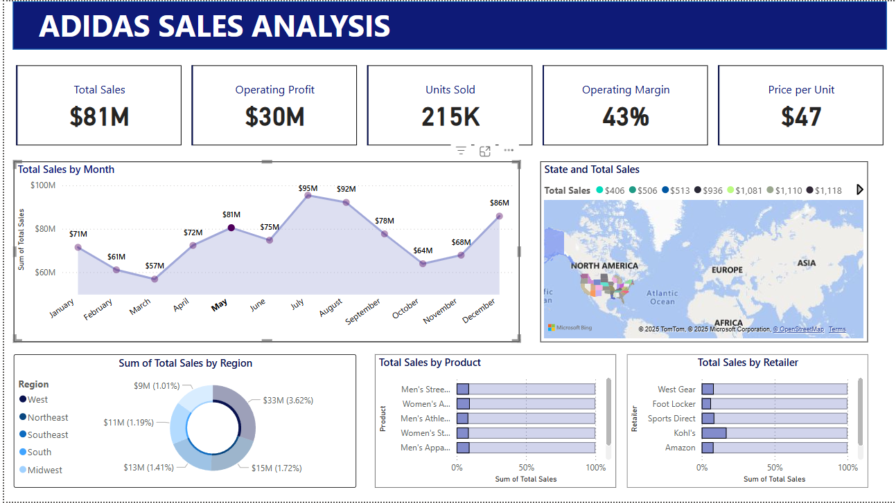

# Adidas Sales Dashboard in Power BI

## Overview
This project involves designing and developing an interactive Power BI dashboard to analyze Adidas sales data. The dashboard provides insights into sales trends, product performance, regional distribution, and key performance indicators (KPIs) to support data-driven decision-making.

## Features
- **Comprehensive Analysis**: Visualizes sales data for revenue, product categories, and regional performance.
- **Actionable Insights**: Identifies growth opportunities and tracks KPIs like operating margins and total sales.
- **Data Highlights**:
  - Analyzed over **10,000 data points**.
  - Uncovered **15% revenue growth opportunities**.
  - Monitored **$2.4M in total sales** across multiple product categories.

## Technologies Used
- **Power BI**: For dashboard creation and data visualization.
- **Excel**: For initial data storage and preprocessing.

## Report Image

## Dataset
The dataset includes information on:
- Retailers
- Invoice dates
- Regions, states, and cities
- Product categories
- Sales figures (units sold, total sales, operating profit, etc.)

## How to Use
1. Open the Power BI file: `adidasSalereport.pbix`.
2. Interact with the visualizations to explore sales insights.
3. Modify or update the dataset to analyze new trends.

## Key Insights
- Identified regions with the highest revenue contributions.
- Evaluated product performance to optimize inventory management.
- Pinpointed key areas for improving operational efficiency.
